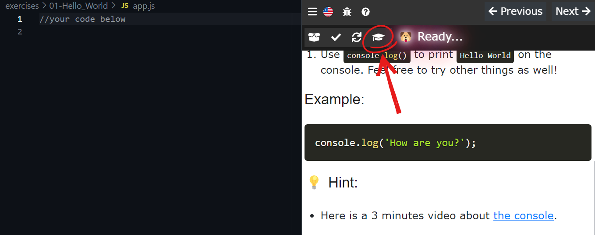
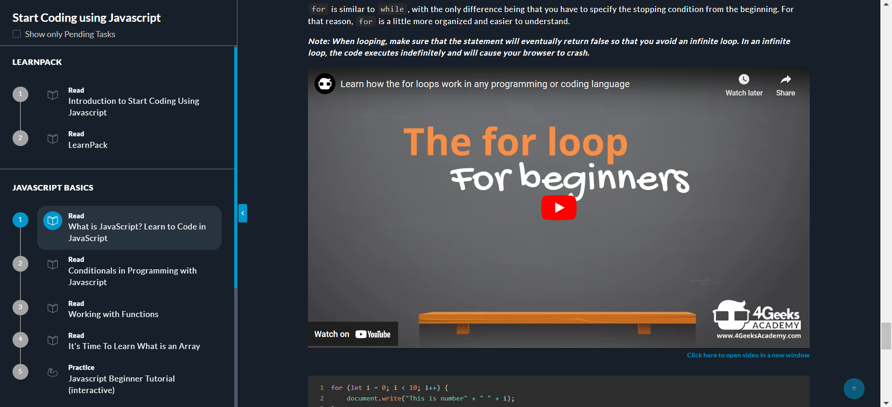

# Video Tutorials

At 4Geeks, we encourage a bit more autonomy in your learning journey. You'll have the opportunity to decipher things on your own and become self-taught, which can be super beneficial. It's all about developing that capacity for understanding, which will not only benefit you in your programming journey but also in various aspects of life. So, embrace the challenge, because it's a fantastic skill that will stay with you forever! 

## 😎 We are here for you 

We know that learning online can be challenging and even more when we are talking about programing. That's why we want to make it as easy as possible for you! We've got your back every step of the way! Whenever you feel stuck, we're right here by your side to lend a helping hand. To make things even better, we've designed some videos that will be super helpful during your programming journey. They'll provide clear explanations on how to do things step by step + valuable tips to keep you moving forward with confidence.

### Where Can You Find Them?

These videos are distributed in different parts of the course. For example:

Imagine you're trying out one of our interactive exercises. Sometimes, you might feel a bit stuck or unsure about what to do. But don't worry! Just look at the top of the screen, and you'll see a symbol of a mortarboard, like a graduation cap. Click on it, and voila! You'll find a video tutorial that guides you through the task, explaining each step in a simple and short way.

> Here is the link of the video if you want to watch it and see how is it like: https://www.youtube.com/watch?v=gMe0ZOHaYQw

Another place where you can find these types of videos is in our lessons! They are intended to help you form better bases on a specific topic.

Whether you're stuck on something, unsure how to proceed, or simply want a complete explanation on a specific topic, our videos are here for you! They're super handy and readily available whenever you need them, especially during practical exercises or projects. So, never hesitate to dive into our collection of helpful videos to level up your skills and conquer any challenge that comes your way.