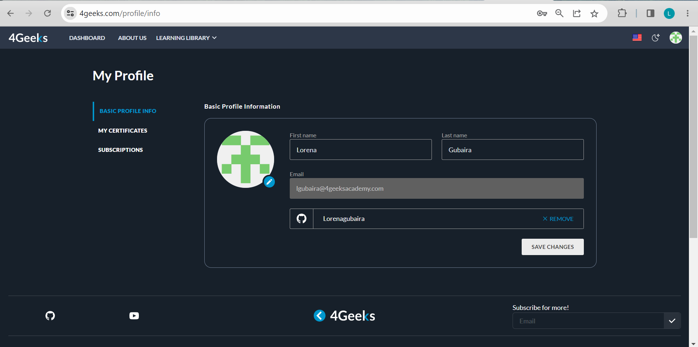
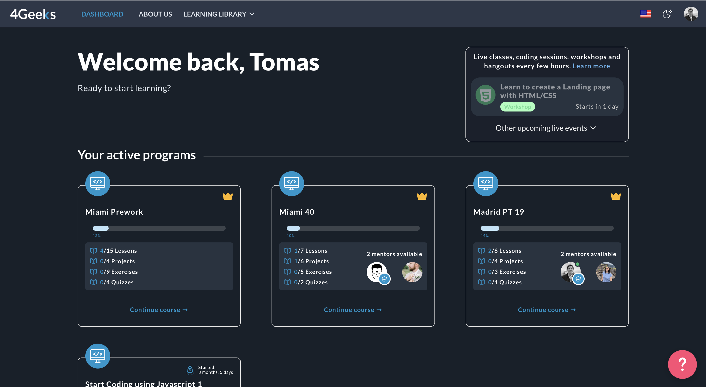
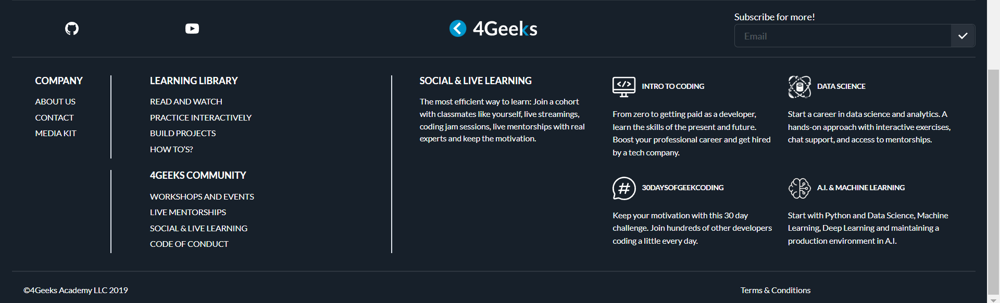

# Account Management

If you are reading, this is because you decided to join our geek's community! We're happy to have you on board. To make sure you have a full experience, we're here to guide you through managing your 4Geeks account. In this article, we'll walk you through all the important steps and features that will help you navigate your coding journey like a pro 😎. So, let's get started and make the most out of it!

> *Before getting started if you haven't created an account already, you can read the article [Getting Started With 4Geeks](url); here we explain step by step how to create it ;)*

## ⚙️ Account Settings:

Once signed in, in the upper right part of the screen you will find your profile picture; if you click there you will see the account settings. Here, you can personalize your profile, update contact information, and manage your preferences.

Additionally, once you enter the settings of your profile, you will see on the left a menu where you can see the certificates you have obtained and your subscriptions.

## 💻 Dashboard Overview:

Familiarize yourself with the dashboard! The dashboard is your control center. It provides an overview of your account.

There will be shown all the available **active programs** that you have. Each program is clearly displayed, allowing you to quickly access the information you need. You can easily navigate through the dashboard to explore program details, such as how much of the course you have done so far, and keep track of how many quizzes, lessons, projects and exercises you have completed.

Also, we've got you covered with an interactive menu located at the bottom of the page. It's your one-stop shop for accessing all the information you need about 4Geeks! With this user-friendly menu, you'll never have to worry about getting lost while conducting your research. Everything you need is just a scroll away, making it convenient and hassle-free for you to explore and find what you're looking for.

## 🔐 Privacy and Security:

To ensure the privacy and security of your account on 4Geeks.com, here are some tips you can take:
- Create a strong, unique password for your account.
- Avoid using common passwords or personal information that can be easily guessed.
- Include a combination of uppercase and lowercase letters, numbers, and special characters in your password.
- As an optional step, you can change your password regularly to minimize the risk of unauthorized access.

Finally, familiarize yourself with our [Terms and conditions](https://4geeks.com/terms-and-conditions). There you can find out how we handle your personal information and how we guarantee the safety of each user.

## 📞 Support and Assistance:

If you have any questions or account-related issues, please do not hesitate to contact us at our [Slack Channel](https://4geeksacademy.slack.com/) or via E-mail to .

### That's All!

Well, you are ready to go! By now, you should have a good understanding of how to manage your 4Geeks account and make the most out of your coding journey. Remember, you have the power to personalize your profile, access your certificates and subscriptions, and explore the active programs on your dashboard. And don't worry, we've taken your privacy and security seriously, so you can enjoy a safe learning environment 😉

