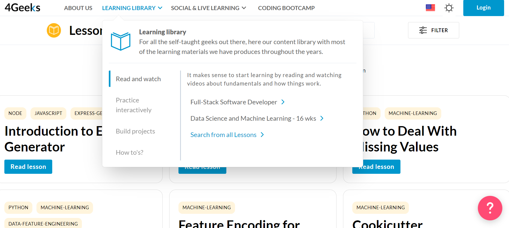

# Getting Started with 4Geeks

We understand that choosing where to start your coding journey can feel like diving into a sea of endless options. But don't worry, we've got your back!

We've dedicated years to studying the most effective ways of learning, and we've put all that knowledge into our courses. We've carefully crafted a ***[special formula](https://4geeksacademy.notion.site/4geeksacademy/Mastering-Technical-Knowledge-984d2df394c44aedb05987311ccfcf06)*** that maximizes your learning experience in every way. So, no need to stress about searching for multiple methods to learn programming. With 4Geeks, everything you need is right here, all in one place, and with a completely fresh approach. So let's make coding simple, fun, and exciting together!

So...are you ready to start becoming a great programmer!?

In this article, we will guide you through the necessary steps to begin your journey with 4Geeks and make the most out of its learning resources. Whether you're an absolute beginner or already have some programming experience, we have something for you! 😉

## Step by Step 💻

### 1. Signing up for 4Geeks:

The first step to getting started with 4Geeks is to sign up. Visit our official website [4geeks.com](https://4geeks.com/login?tab=register) and look for the registration option. Provide the required information and create an account.

> *Remember to keep your login credentials in a secure place.*

### 2. Exploring the Learning Library:

Once you have created your account, you'll gain access to the Learning Library. This section is like a collection of knowledge waiting to be explored! It's your go-to place for a wide range of learning resources that cover various topics and technologies. Whether you're looking for tutorials, articles, excercises, or even coding challenges, we've got you covered. You can dive into the materials at your own pace, pick up new skills, and expand your understanding of programming concepts. So, grab a cup of coffee, settle into your favorite learning spot, and let your curiosity guide you.

### 3. Choose Your Learning Path:

At [4Geeks](https://4geeks.com/about-us#4geekscom-platform) we understand that everyone has an agenda and a learning style, so it is important take the time 🕓 to explore the available options and choose a learning path that aligns with your interests and goals. 

That's why we offer different learning paths to suit your needs. For example, if your are looking for more flexibility, our **Open Learning** option is the best for you! It provides a flexible and self-paced journey with small courses in various technologies. You can join courses for free, access live workshops, and receive 1-on-1 mentorship as needed. Learn anywhere, anytime with your chosen methodology.

On the other hand, if you're seeking a career-focused experience, our [Bootcamps](https://4geeksacademy.com/us/programs) are perfect for a fast-paced career change. Dive into courses like:
- [Full Stack Web Development](https://4geeksacademy.com/us/coding-bootcamps/part-time-full-stack-developer).
- [Software Engineering](https://4geeksacademy.com/us/coding-bootcamps/software-engineer-bootcamp).
- [Data Science Engineering](https://4geeksacademy.com/us/coding-bootcamps/data-science-engineer).
- [Machine Learning and AI Engineering](https://4geeksacademy.com/us/coding-bootcamps/machine-learning-engineering). 

Enjoy all the benefits of Open Learning plus lifelong [career support](https://4geeks.com/about-us#career-support-geekpal). Choose the path that fits your goals and thrive in the tech industry with 4Geeks!

### 4. Join the 4Geeks Community 👨‍👩‍👦‍👦:

Be part of our big community with over 15,000 members who come together on 4Geeks.com to connect, learn, and grow their coding skills. Whether you're participating in mentorships, workshops, master classes, or interactive courses, you'll have the opportunity to collaborate and network with fellow geeks.

As a premium member, you'll also gain access to our exclusive [Slack channel](https://4geeksacademy.slack.com/), where you can receive 12-hour chat support and interact with experts who are ready to answer your questions. 

> 👀 Exciting news is on the horizon! Soon we're opening offices around the world, providing even more opportunities for in-person workshops, coding weekends, and engaging activities!

## Are You Ready? 😎 

Time is precious, and we couldn't agree more! So, what are you waiting for? Don't waste another minute. Take the leap and start your coding journey with us at 4Geeks. We're here to guide you every step of the way, provide you with the tools you need, and empower you to unlock your full potential. The world of coding is waiting for you, so let's dive in together and make great things happen.

*It's time to become a great developer!* 