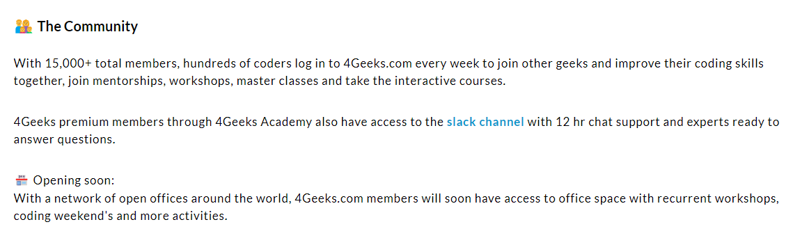

# Getting Started with 4Geeks

If you're interested in learning programming and developing tech skills, 4Geeks is a platform that can provide you with an excellent knowledge foundation. In this article, we will guide you through the necessary steps to begin your journey with 4Geeks and make the most out of its learning resources. Whether you're an absolute beginner or already have some programming experience, 4Geeks has something for you! 😉

## Step by Step 💻

### 1. Signing up for 4Geeks:

The first step to getting started with 4Geeks is to sign up. Visit our official website [4geeks.com](https://4geeks.com/login?tab=register) and look for the registration option. Provide the required information and create an account.

> *Remember to keep your login credentials in a secure place.*

### 2. Exploring the Learning Resources:

Once you have created your account, you'll gain access to a variety of learning resources on 4Geeks. Feel free to explore all the different sections like courses, tutorials, and projects. These resources will give you a solid programming foundation and help you acquire new skills. 

### 3. Choose Your Learning Path:

We offer a wide range of courses and specializations in various programming areas. Before diving into a specific course, take the time 🕓 to explore the available options and choose a learning path that aligns with your interests and goals.

### 4. Follow the Courses Step-by-Step:

Once you have selected a course, follow the lessons step-by-step. We have designed each course in a structured and sequential manner to facilitate your learning! Make sure to grasp each concept before moving on to the next one, and take advantage of all the additional resources like practical exercises and projects to reinforce your knowledge.

### 5. Join the 4Geeks Community:

4Geeks has an active community of students and programming professionals. Take this opportunity to connect with other learners, ask questions, share your projects, and get support. The 4Geeks community is a valuable resource that can help accelerate your progress and expand your professional network.

### 6. Practice and Build Projects:

Programming is best learned through practice. As you progress through your courses, don't forget to apply what you've learned in personal projects. Build simple applications, create websites, or work on coding challenges. Practice will help solidify your knowledge and develop your problem-solving skills.

*It's time to become a great developer!* 😀
