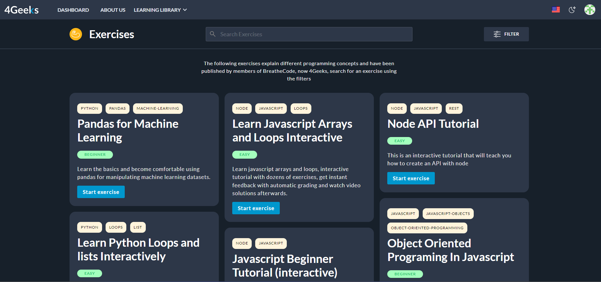
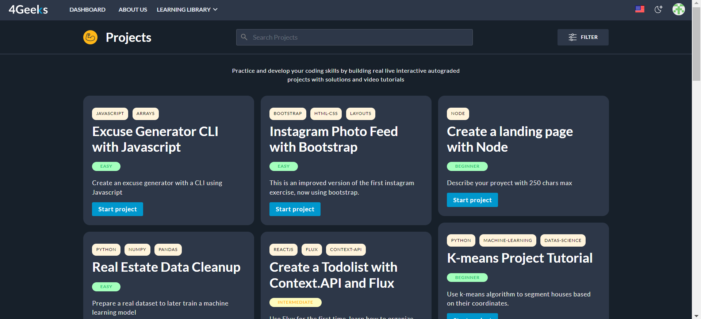
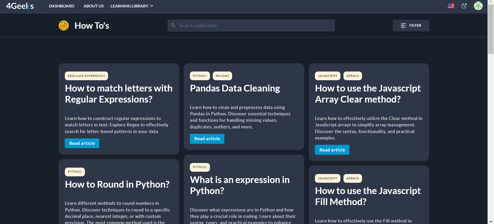

# Learning with 4Geeks

At 4Geek we're all about making learning a fun and fulfilling experience! We believe that education should be hands-on, motivating, and tailored for people just like you. That's why we've come up with our own teaching method that combines all the best. Our ***[special formula](https://4geeksacademy.notion.site/4geeksacademy/Mastering-Technical-Knowledge-984d2df394c44aedb05987311ccfcf06)*** focuses on **Memory Retention** 🧠, **Feedback Quality** 🗣️, **Learning Mastery** 💡, and **Motivation** 💪 - all the ingredients for a well-rounded and effective learning journey. We've put in the hard work, collaborated with experts, and created an environment where you can truly thrive.

## 🥇 Certifications and Courses

We know life can get pretty busy sometimes... That's why we've designed two types of experiences: **Open Learning** and **Immersive Bootcamps**.
Let's break it down and explore the benefits of each option, so you can choose the best fit for your goals and needs. Whether you prefer a flexible and self-paced learning journey or a more immersive and structured experience, we have something for you.

### 1) Open Learning:

Open Learning is perfect for those who do not have much time on their agenda but still want to have complete learning about a specific topic. You will be able to join any of them for free in different technologies like Javascript, Python, ChatGPT, etc.

We have listed some benefits that this type of experience has to offer:
 
- **Flexibility**: Set your own pace and choose when and where you want to study.
- **Variety of Courses**: Explore diverse topics and choose the courses that align with your interests and career goals.
- **Self-Paced Learning**: Freedom to progress at your own speed, ensuring that you thoroughly grasp the concepts before moving on to the next topic.
- **Workshops**: Access to live workshops from industry experts every week (included with subscription)
- **1-1 Mentorship**: A truly game-changer! Picture this, you get to meet with experienced tech industry experts who will guide you through those tough concepts, assist you when you're feeling stuck, and help you level up your skills. These [sessions](https://4geeks.com/mentorships) are with real everyday developers who know their stuff and can answer all your burning questions. The best part? You have the flexibility to choose a time that suits your schedule perfectly.

### 2) Immersive Bootcamps:

Bootcamps are for people who want to make a significant career change and improve their lives. They are programs that fully train you in a specific area, preparing you for successful job placement in the future.

If you're seeking an immersive experience and a fast-paced career shift, Bootcamps are the way to go! These comprehensive programs last for about 18 weeks and require a certain level of commitment. They're designed to provide you with top-notch skills, that will help you a lot in your coding journey! You can choose from specialized tracks like: [Full Stack Web Development](https://4geeksacademy.com/us/coding-bootcamps/part-time-full-stack-developer), and [Data Science and ML](https://4geeksacademy.com/us/coding-bootcamps/datascience-machine-learning).

Bootcamps also offer all the benefits of **open learning**, but with a couple of added advantages:

- **Lifelong Career Support**: One of the key advantages of our Bootcamps is the addition of [career support](https://4geeks.com/about-us#career-support-geekpal) for life.
- **Networking Opportunities**: Connect and collaborate with like-minded individuals and industry professionals.
- **Practical Projects**: Gain experience with real-world projects that helps build your portfolio and prepares you for the challenges of the job market.
- **Specialized Tracks**: Specialized tracks in high-demand fields that will help you develop expertise in specific areas.
- **Job Guarantee Program**: With this program, we've got your back in landing a job related to your studies! Wondering how we do it? Simple. We'll equip you with all the essential skills for workplace success. You'll learn from experts, master the art of interviews, and create a top-notch portfolio and resume, plus loads of tips to make you shine. Together, we'll ensure you stand out and nail that dream job.
- **Lifelong Unlimited Mentorships**: Designed to support your journey in the tech world. Our commitment to your success goes beyond the bootcamp duration. With our unique program, you'll have access to experienced mentors who will guide and assist you at any stage of your career!

So... Whether you prefer the flexibility of **open learning** or the immersive experience of **bootcamps**, at 4Geeks we will provide you with excellent opportunities to enhance your knowledge and skills in the ever-evolving world of technology and programming.

## 👨‍👩‍👧‍👦 Welcome To Our community!

One thing you should know is that by joining our community, you will have access to a lot of material that will help you bring out the programmer in you!

In your dashboard, you will have access to the following sections:

### 📖 Lessons:

We have a bunch of lessons waiting for you! They are crafted with a purpose—to help you gain a solid foundation and dive into deeper waters of knowledge. Each lesson is designed to provide you with a comprehensive understanding of a specific topic. They were made to be engaging and enjoyable, so you won't feel overwhelmed.

We want to equip you with the necessary tools and insights so that you can confidently explore and delve deeper into the subject. Our goal is to give you a complete idea and a strong foothold on the topics we cover.

### 🏋️ Exercises:

Exercises help you truly understand concepts, build confidence, and develop problem-solving abilities. By getting hands-on with coding challenges, you reinforce what you've learned, tackle real-world problems, and build your coding muscle! Plus, it's load of fun and makes you a better programmer in the long run.

### 🌱 Projects:

Our projects are just what you need when you're up for more complexity! These challenges are specially crafted to put everything you've learned about a specific topic to the test. Once you feel confident with your solid foundations, dive into these projects and watch yourself grow! And don't worry, we've got your back with helpful tools like videos, instructions, solutions, and more, so you won't get stuck along the way.

### 🔍 How To's?:

In this section, you will find answers to the most common questions that arise while learning programming. These articles are designed to tackle specific topics and guide you step by step to overcome those tricky obstacles. We want to make sure you never feel stuck while programming, so we've put together detailed explanations and solutions to keep you on track.

### 🕊️ Code will Set You Free!

There you have it! We hope this gives you a glimpse of all the great opportunities that await you. We're here to help you unlock the potential that lies within you. Get ready to learn, grow, and achieve great things. We can't wait to see what you'll accomplish!

