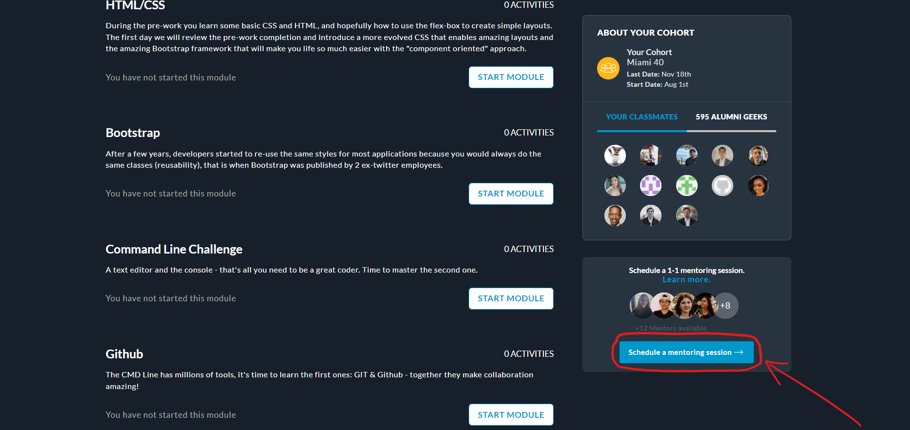
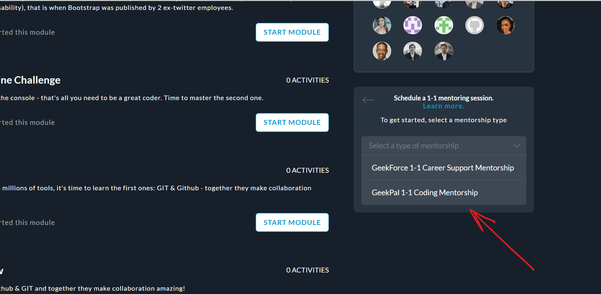
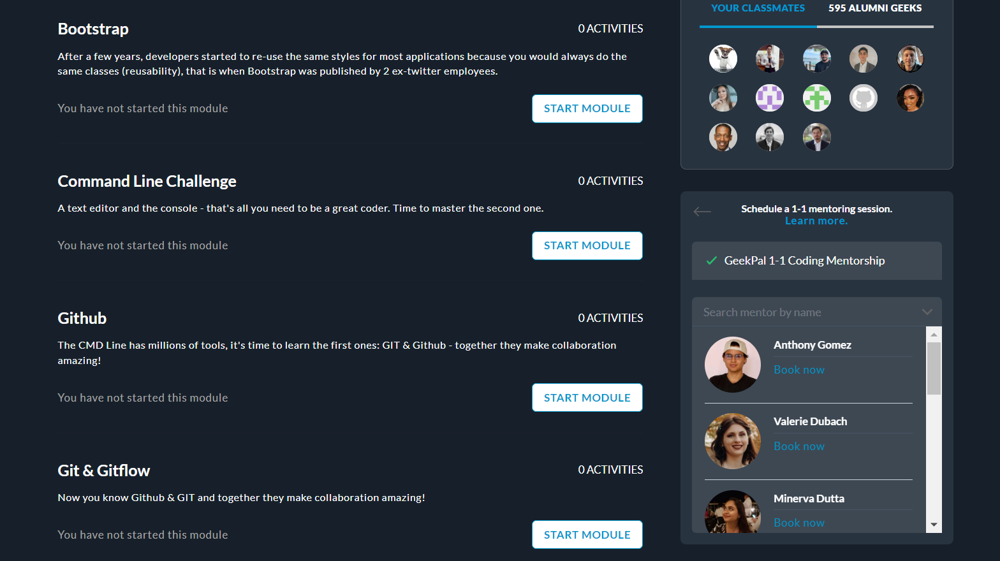
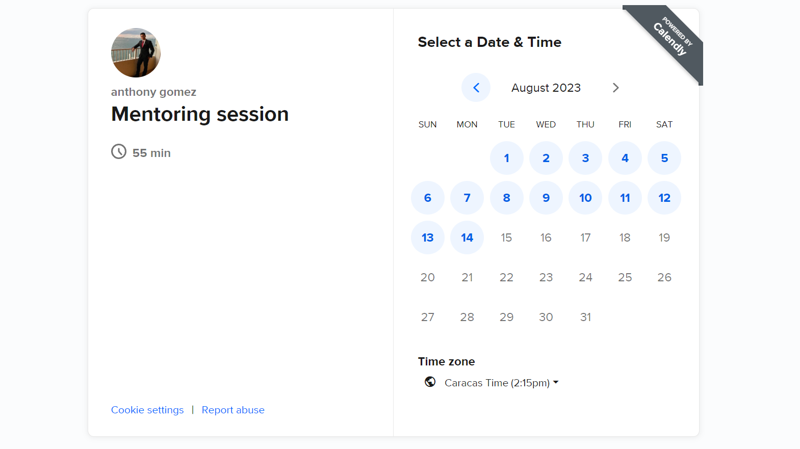

# Mentoring Sessions

In Mentoring sessions you get the opportunity to meet and learn from experienced tech industry mentors. These experts are super helpful, and they'll guide you through even the most challenging concepts. Whenever you feel stuck, they'll be right there to assist you, ensuring you level up your skills in no time.

What's even better is that these sessions are conducted with real everyday developers who know what they are doing and are trained to be able to teach you in the clearest way possible. So, any burning questions you have, they've got the answers! Plus, you have the freedom to choose a time that perfectly fits your schedule. 🤓

No matter which modality you go for, you have the chance to clarify any doubts you may have with a real pro in the field! We care deeply about your learning journey, and we believe that when you can get all your questions answered, it'll help you build rock-solid foundations.

That's why we've made sure you can have these mentoring sessions whenever it suits you best. We want your learning experience to be as convenient as possible, so you can focus on growing and killing it out there!

### 📆 Steps to Schedule a Mentoring Session

1. Once you're in your program, look to the right-hand side. There, you'll find the **cohort** section. Right below it, you'll see a block titled **Schedule a 1-1 mentoring session**. That's where you can set up a personal mentoring session.

2. When you click on the blue button that says **Schedule mentoring session**, you'll see different options on the screen. Just click on the one that says **GeekPal 1-1 Coding Mentorship**.

3. On the screen, you'll see a list of all our mentors who are ready to help you out. Take your time and pick the one you feel most comfortable with. Once you've made your choice, just click on "Book Now", and you can then select the day and time that works best for you.

4. You're almost there! Now, all you have to do is check your mentor's availability in their agenda. Once you find a suitable time, you can go ahead and book the mentoring session you need. It's as simple as that.

So, there you go! Now you have an incredibly useful tool to help you learn to code. Feel free to use it as often as you need. And remember, we'll be here supporting you every step of the way. 😉

