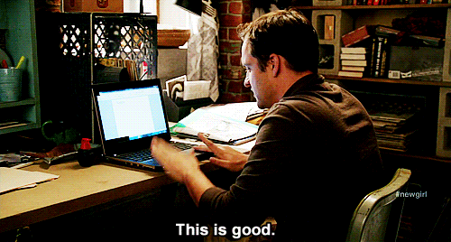

# Searching For Courses

Finding the right course can be a bit overwhelming with so many options out there... If you're all set to dive into the world of coding but don't quite know where to begin, don't worry, we've got your back! In this article, we'll help you find the perfect path to achieve all your goals here at 4Geeks. So, let's get started on this journey together 🌱.

## Let's Get Started!

We've come up with some really useful tips to help you see your desired path more clearly. These tips are here to guide you and support your goals and dreams. We hope that by following these simple suggestions, you'll be able to make better choices and find more clarity on your journey towards success!

So let's begin with these 5 tips, shall we?:

### 1. Know Your Passions 🧠

First things first, ask yourself, "What do I absolutely love to do?" Whether it's Web Development, Data Science, becoming a full-stack guru, or hone your skills in a specific topic, we've got courses to match your passions! Knowing what excites you will make this journey even more enjoyable.

###  2. Explore Our Programs 🔍

Head over to our website, where everything happens! Browse through the variety of courses we offer. You can quickly find all the information in the **Learning Library** section that is at the top of the screen at [4Geeks.com](https://4geeks.com/choose-program).
You will be impressed with the variety of options just waiting for you to explore. Feel free to click around, read course descriptions, and get a taste of what each course has to offer.

### 3. Check Out Student Reviews ⭐

Listening to other people's experiences is awesome! If you're curious about a particular course, check out the feedback from our students. It's a great way to get an idea of what to expect

### 4. Know your availability ⌚

Life can get super busy, right? So, before jumping into a course, it's smart to check how much time you can spare. Once you've got that figured out, it's time to pick the perfect course for you! At 4Geeks, we've got two program options:

- Open Learning: If you need flexibility, this is your way to go! You can go at your own pace, with short courses lasting 1 or 2 weeks on average.

- Bootcamps: If you are looking for a thrilling career change, this is your option. It's a complete experience, with courses lasting around 16 weeks.

So, think about your time, and pick the program that suits you best!

### 5. Set a Goal 💪 

To make things simple, set a goal for yourself – it could be short, medium, or long-term. Then, take a look at our courses and see which one aligns perfectly with your goal. That way, you'll get the right tools to reach your goal in the most direct and efficient way possible! Having a clear goal makes a clear path :)

So...There you have it! We hope these tips have helped you and that you put them into practice when starting any path you decide to take! Remember that you carry within you that great programmer who wants to shine and we will help you at all times. See you soon!

> Ohh, and remember... ***[Code Will Set You Free](https://4geeks.com/about-us#certifications-and-courses)*** ;)